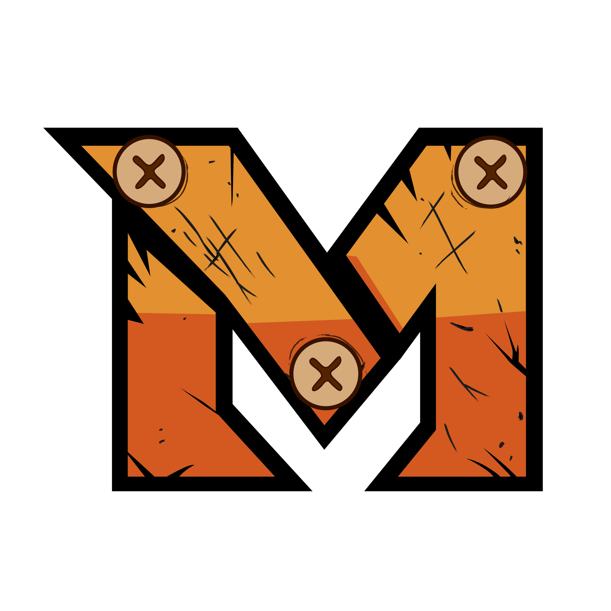

  

  # Makers e.V.

  ### Hier machst du nicht nur mit – hier machst du den Unterschied!

  
  
  
  
  

---

## 🛠️ Wer wir sind

**Makers e.V.** ist ein gemeinnütziger Verein aus Hanau und betreibt einen modernen **Makerspace**, in dem digitale und analoge Fähigkeiten aufeinandertreffen. Wir richten uns an junge Menschen zwischen **14 und 27 Jahren**, die Lust haben, eigene Ideen selbst in die Hand zu nehmen.

Statt klassischem Frontalunterricht setzen wir auf **projektbasiertes Lernen** und **Mentoring**: Erfahrene Mentor:innen begleiten euch dabei, eigene Projekte von der ersten Idee bis zum fertigen Prototyp umzusetzen.

## 💡 Was wir machen

**Digitale Skills**
- Programmieren & Elektronik
- 3D-Druck
- Game Design
- Webdesign
- Film- & Medienproduktion

**Analoge Skills**
- Holz- & Metallbearbeitung
- Prototyping & Modellbau
- Werkzeug- und Maschinensicherheit

## 🎬 Unsere Maker-Bereiche

| Bereich | Fokus |
|---|---|
| 🎥 **Film MAKERS** | Film- und Medienproduktion |
| 🪚 **Craft MAKERS** | Handwerk, Prototyping, Modellbau |
| 🎮 **Game MAKERS** | Game Design & Entwicklung |

## 🤝 Mitmachen

- 🙋 **[Mitglied werden](https://www.the-makers.space/)** – werde Teil der Community und starte dein eigenes Projekt
- 💶 **Spenden** – unterstütze unsere Arbeit mit jungen Menschen
- 🏢 **Förderer werden** – als Unternehmen die Maker-Idee fördern
- 📋 **Auftraggeber werden** – gemeinsam mit unseren Makern Projekte realisieren

## 📬 Kontakt

Mehr Infos, unser Blog und alle Kontaktmöglichkeiten findet ihr auf **[the-makers.space](https://www.the-makers.space/)**.

  Made with 🧡 by the Makers community – Hanau

